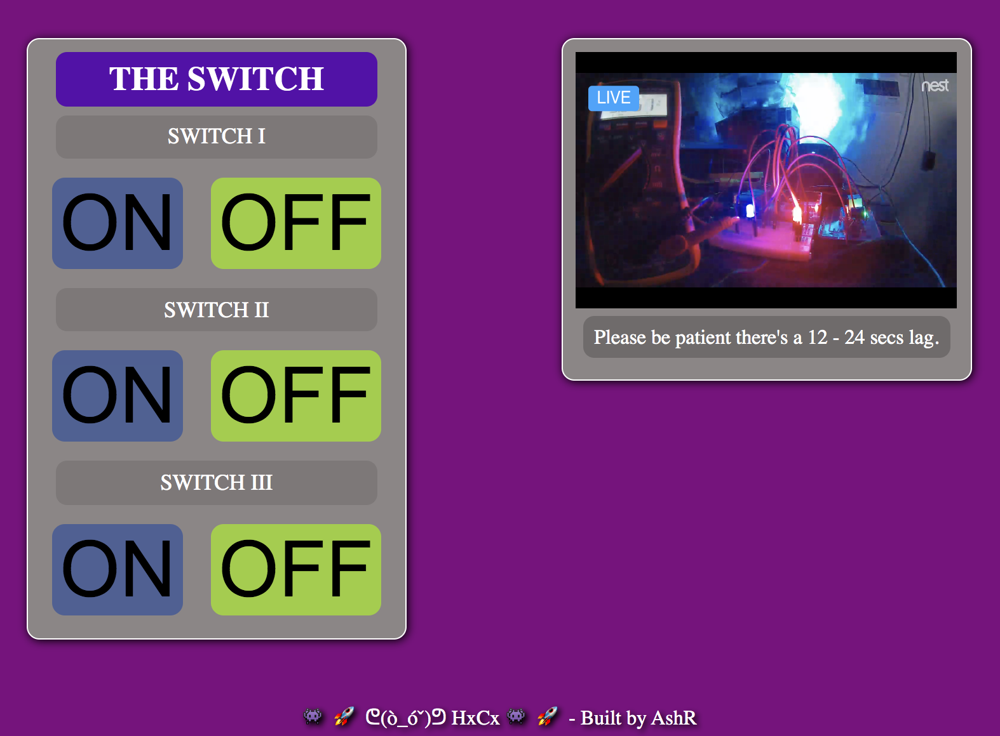
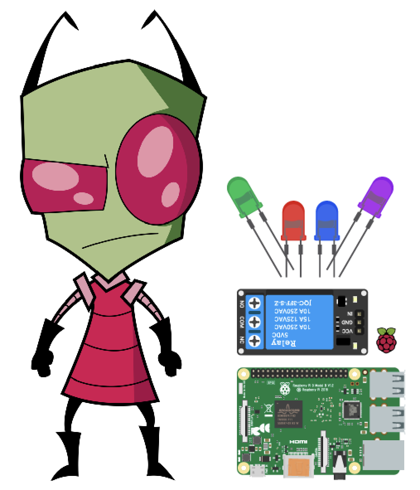
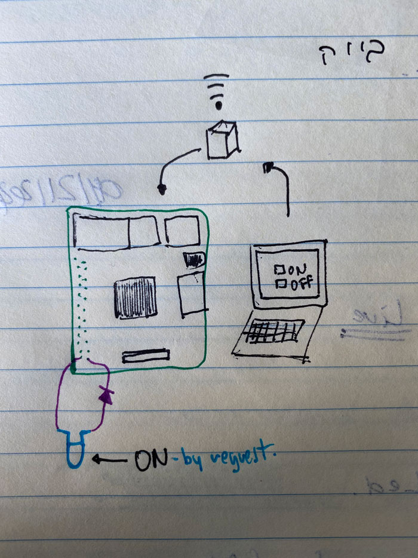
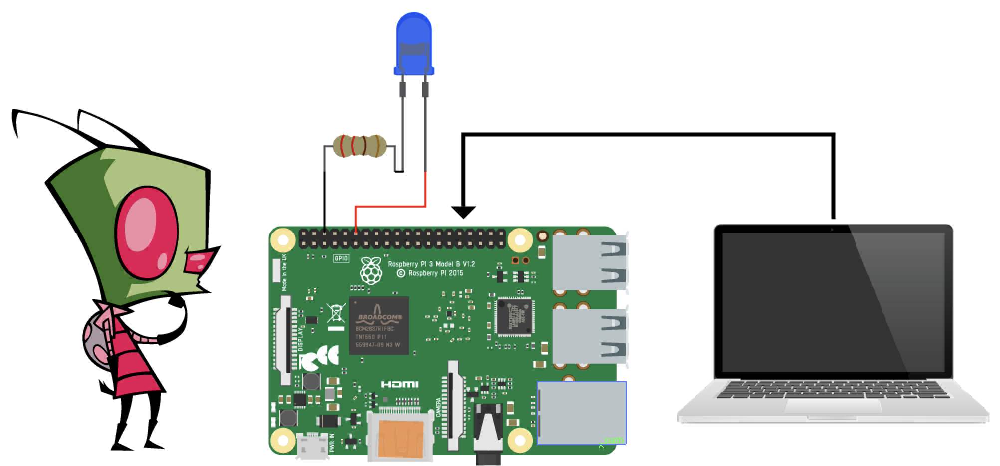
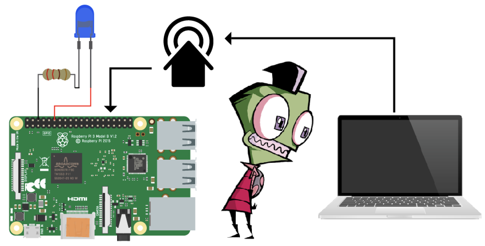
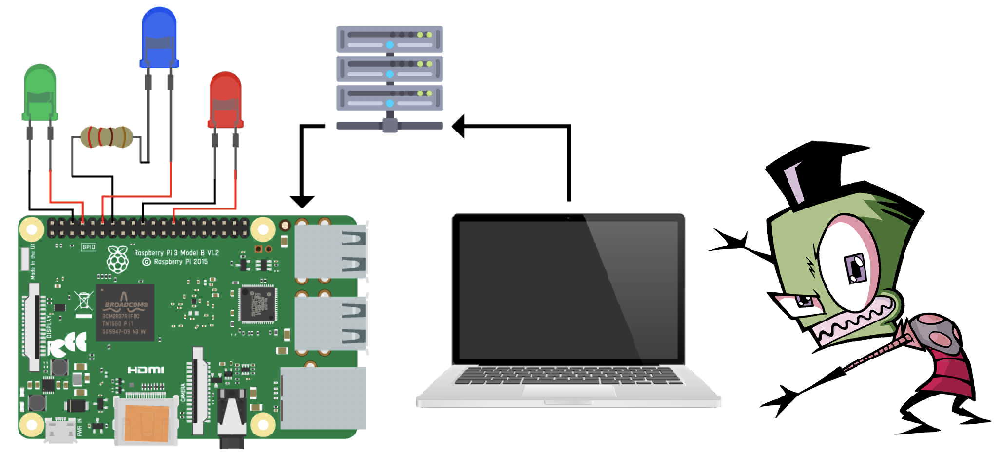
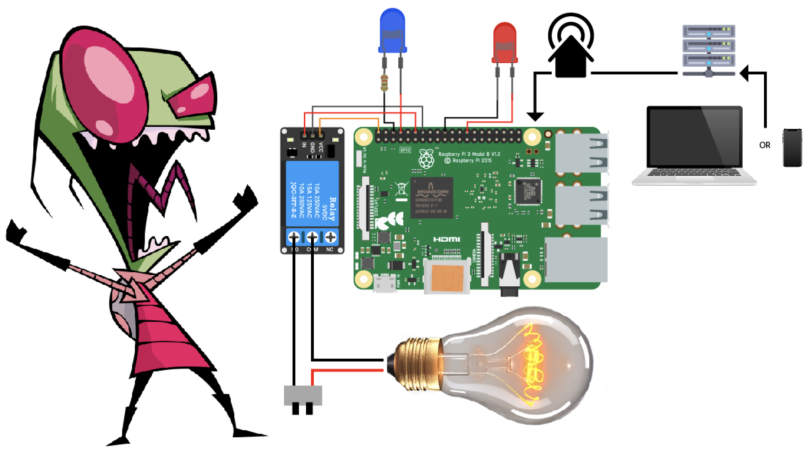
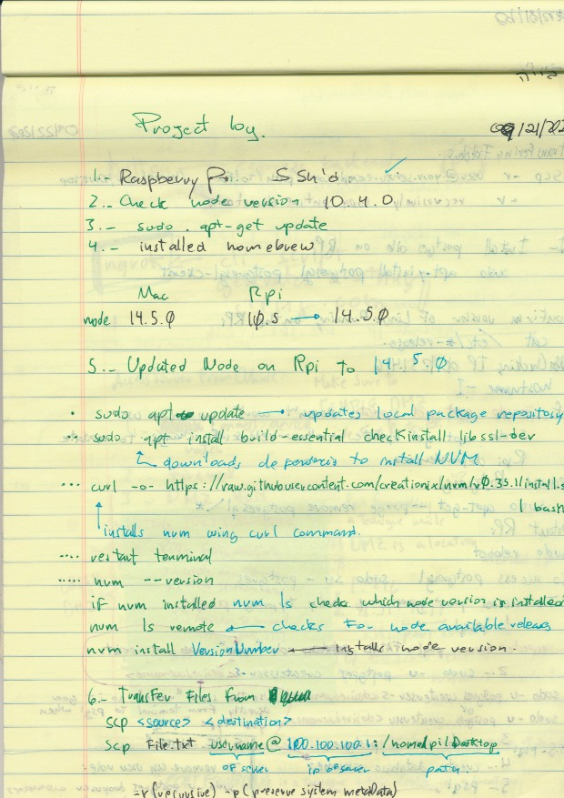
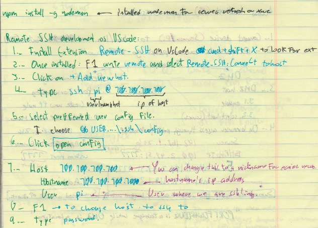

09/21/2020

SERVER WILL NOT RUN FROM FRIDAY 12:00 EST - SUNDAY 12:00 EST

# The Switch \m/

Link: http://100.2.48.51:7777 LiveFeed Window added next to Remote.

LiveFeed: https://video.nest.com/live/P4iZwFBva5 (There's a 12-24 secs. lag, pls be patient)

PresentationDraftPt1 https://youtu.be/w86qFmONI_I

PresentationDraftPt2 https://youtu.be/hQrsaei6D9o

(DISCLAIMER : the following information is subject to change based on developing phases and dev. brain capacity. )

# The switch

A home automation utility.

## The App

This App will allow the user to control electronic devices, from anywhere in the world, hopefully the universe.

### What is your project?

With the GPIO and proccesing power of a R31416, a solid backend and a dependable server i have built a home automation
system, at the moment it controls a funny projection lamp and a couple of light emiting diodes, but it can basically control,
anything that requires electricity, acting as a smart hub...or anything i can get asked to do.

### Wireframes!

### User Stories

- User access a website
- User sends ON request.
- Device turns on.
- User sends OFF request.
- Device shuts off.

### Circuit Diagram Evolution:

The first challenge was to find a way to use Javascript to control the GPIO pins on the R31416.

Second challenge was to be able to control it through another computer, at least inside the same network...a server maybe?? but HOWWWW???

When i was finally able to control the inputs not only from the local network, but had turned the r31416 on a server that hosted the site with all controls of the GPIO and the LED turned ON!!

Now it was time to make the little monster machine functional in a real home environment, added a relay some frankensteined electronics and IT WORKED!! at around 3:30 EST in the AM it worked.

### 3rd Party Technologies

- Google Search.
- Raspberry Pi.
- Relay
- CDN
- Server Infraestructure

### Initial thoughts on app structure

### Phases of Completion

- Project proposal
- Server Live
- Circuit Diagram
- Scout GPIO on Rpi
- Circuit engineering.
- Light up an LED.
- Electric elements dev.

### Links and Resources

- RSO
- The Wizards (P,J,D,M)
- CSS + HTML + Jsvascript \m/
- The Google and it's capacity to develop our Googliness.
- BH brain capacity, time management, and a shton of GIFD.

### The Beginning...

The first time the LED turned on by a local input:

https://www.youtube.com/watch?v=Ro7XKjRe7x8

Local network test from a cellphone on headless R31416:

https://www.youtube.com/watch?v=kwXusMJCzow

Pete tests controlling the the LED from Boston:

https://youtu.be/w69J62LpRy8

### Some notes extracts:

## Dependencies used

  - "onoff": "^6.0.0"
  - "socket.io": "^2.3.0"
